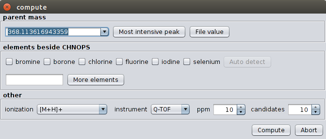

################
User Interface
################

With Sirius 3.1 our software ships with an user interface. Please be aware that the user interface have to be downloaded separately from the commandline tool. Take sure that you downloaded a file named SiriusGUI.exe.

.. figure:: images/gui.pdf

Overview
---------

On top of the screen you find the toolbar(1). On the left side is the experiment list (2) displaying all imported experiments. An experiment describes the set of MS and MS/MS spectra corresponding to a single measured compound. If an experiment is successfully computed you will see a tick mark on the right (3); if something goes wrong during computation you will see a cross symbol (4). The output of a computation is an ordered list of suggested molecular formula candidates. After selecting an experiment in the experiment list the candidate list (5) should display all molecular formula candidates together with their score. When selecting a candidate, the tree viewer (6) displays the computed fragmentation tree. Nodes in the tree are colored according to their score.

Data Import
------------

Sirius offers two modes for data import: **Single Import** and **Batch Import**. The Single Import is triggered when clicking on the *Import* button in the toolbar. It allows you to import **one** experiment. We will use the term experiment as a description of MS and MS/MS spectra belonging to a single compound.
The Single Import mode is recommended if your data consists of several csv (comma separated values) files (like the data from the CASMI challenges). First press on *Import* to start the import dialog.

.. figure:: images/load.png

For each spectrum you have to select the MS level (either MS 1 or MS 2). If you have MSn spectra you can just import them as MS 2 spectra. You can select a name for the experiment as well as an ionization mode. The collision energy is an optional attribute as it does not affect the computation.

You can import *.ms* and *.mgf* files using the *Batch Import*. In this mode Sirius will read all attributes (MS level, ionization, parentmass) directly from the file. You can, however, change these attributes afterwards by selecting the imported experiment and clicking on the **Edit** button.

See section *Supported Input Formats* for a description of the file formats *.ms* and *.mgf*.

Drag and Drop
...............

Sirius supports Drag and Drop: Just move your input files into the application window. This is usually the easiest way to import data into Sirius. Supported file formats for Drag and Drop are *.csv*, *.ms*, *.sirius* and *.mgf*.

Computation
------------

As for importing data Sirius offers two computation modes: **Single Computation** and **Batch Computation**. The Single Computation allows you to setup different parameters for each experiment. You can trigger it by right-clicking on an experiment and choosing **Compute** in the context menu. The Batch Computation will run in background and compute all experiments in the workspace.

parent mass
..............
The exact m/z of the parent peak. If MS 1 data is present, the m/z of the monoisotopic peak is presented as default. Otherwise, an autocompletion offers a list of high intensive peaks from the MS 2 spectra.

elements besides CHNOPS
........................
Sirius will use the elements carbon (C), hydrogen (H), nitrogen (N), oxygen (O), phosphorus (P) and sulfur (S) by default. Additional elements can be selected in the checkboxes. Adding elements that do not occur in the correct molecular formula of the compound will usually not lead to wrong results but to an increased running time of the algorithm.

other
.........
The ionization mode determines the polarity of the measurement (positive or negative) as well as the adduct (e.g. protonation or sodium adduct). If you choose **Unknown Positive** or **Unknown Negative** Sirius will not care about the adduct, but report the molecular formula of the **ion** in the candidate list. Otherwise, Sirius will subtract the adducts formula from the ions formula and report neutral molecular formulas in the candidate list as well as in the fragmentation trees.

Choose either *Q-TOF*, *Orbitrap* or *FT-ICR* in the instrument field. The chosen instrument affects only very few parameters of the method (mainly the allowed mass deviation). If your instrument is not one of these three then just select the Q-TOF instrument.

You can change the maximal allowed mass deviation in the **ppm** field. Sirius will only consider molecular formulas which mass deviations are either below the chosen ppm or smaller than :math:`\frac{100 \cdot ppm_{max}}{10^6}`

Finally, you can select the number of molecular formula candidates that should be given in the output. But Sirius will search through the space of all possible molecular formulas, anyways.

Visualization of the Results
-----------------------------

The candidate list displays the best candidate molecular formulas ordered by score. Molecular formulas are always written in neutral form, except for compounds with unknown ionization mode. For every molecular formula the corresponding fragmentation tree is visualized in the „tree view“ tab. Alternatively, the „spectra view“ tab visualizes which peak is assigned to a fragment.

Tree View
...........

.. figure:: images/tree_view.png

The tree view displays the estimated Fragmentation Tree. Each node in this tree assigns a molecular formula to a peak in the (merged) MS 2 spectrum. Each edge is a hypothetical fragmentation reaction. The user has the choice between different node styles and color schemes. The shown tree can be exported as JPEG, GIF, and PNG. Alternatively, the Dot file format contains only a description of the tree. It can be used to render the tree externally. The command-line tool Graphviz can transform dot files into image formats (PDF, SVG, PNG etc). The JSON format yields a machine-readable representation of the tree.

Spectrum View
..............

.. figure:: images/spectra_view.png
In the spectrum view all peaks that are annotated by the Fragmentation Tree are colored in blue. Peaks that are annotated as noise are colored black. Hovering with the mouse over a peak shows its annotation.

Workspace
------------

All imported experiments together with their results (the candidate molecular formulas and corresponding fragmentation trees) form the **workspace**. You can save the workspace into a file by clicking on **Save Workspace** in the toolbar. Analogously, you can load a workspace using **Load Workspace**. The workspace is saved in the **.sirius** format, which is simply a Zip Archive containing the input spectra and fragmentation trees. You can share the *.sirius* files with other people. But be aware that the input spectra are contained in these files!

The Sirius Commandline Tool is able to output *.sirius* files by using the option **-O sirius**. You can import these files with the Sirius User Interface to get a visualization of the results.

Export Results
..............

Next to the *.sirius* format you can also export your results as a simple **csv** file by clicking on the **Export Results** button. Such a *csv* file can then be imported into *Excel*, *Matlab* or *R*. The csv file contains the following fields:
 * name of the experiment
 * parent mass
 * ionization
 * for each molecular formula candidate there are two columns: one with the molecular formula and one with the corresponding score

If the number of molecular formula candidates differ between experiments, the number of fields per row might differ, too. However, most software programs do not have a problem with such *malformed* csv files.

Example Workflow
-----------------

Working in Single Mode
......................

 #. Move the three files *txt/chelidonine_ms.txt*, *txt/chelidonine_msms1.txt* and *chelidonine_msms2.txt* from the demo data via Drag and Drop into the application window
 #. The following dialog offers you to select the columns for mass and intensity values. Just press *Ok* as the default values are already correct.
 #. You see the load dialog with three spectra. The first spectra is wrongly annotated as *MS 2* spectrum but should be an *MS 1* spectrum instead. Just select *MS 1* in the drop down list labeled with *ms level*.
 #. All other options are fine. However, you might want to choose a more memorizable name in the *experiment name* field.
 #. Press the *Ok* button. The newly imported experiment should now appear in your experiment list on the left side.
 #. Choose the experiment, right-click on it and press *Compute*.
 #. In the compute dialog all options should be fine. Just check that the correct parent mass is chosen. You might want to add Chlorine or Fluorine to the set of considered elements. Furthermore, you can change the instrument type to *Orbitrap*
 #. Just look into the candidate list: The first molecular formula has a quite large score. Furthermore, the second molecular formula has a much lower score. This is a good indication that the identification is correct. However, you can take a look at the fragmentation tree: Do the peak annotation look correct? Take a look at the spectrum view: Are all high intensive peaks are explained?
 #. You can now save the result list as csv file (by pressing the *Export Results* button). Maybe you want save your workspace, too. Just press the *Save Workspace* button.

 Working in Batch Mode
 ......................

 #. Move the files *Bicuculline.ms* and *Kaempferol.ms* from the demo data via Drag and Drop into the application window
 #. The two experiments are now displayed in the experiment list
 #. Just check if the ionization and parent mass is correctly annotated. You can change this values by clicking on the experiment and then on *Edit*.
 #. Click on the *Compute All* button.
 #. You can now select the allowed elements, the instrument type as well as the maximal allowed mass deviation. Be aware that this settings will be used for all imported experiments
 #. Choose *Orbitrap* in the instrument field and press *Ok*
 #. A *...* symbol occurs on the lower right corner of each experiment. This means that the experiment will be computed soon. A gear symbol tells you that this experiment is currently computed in background. A check mark appears in all experiments that were successfully computed, a red cross marks experiments which computation fails.
 #. Probably you will not see anything than a check mark, as the computation is very fast. However, if you see a compound with a red cross you might want to compute it again in Single Mode. Check if the parent mass and ionization is correct.
 #. Sometimes a computation might take a long time (e.g. for experiments with a lot of elements or very high masses). You can cancel the computation of a single experiment by selecting *Cancel Computation* in the right-click context menu. You can cancel the computation of all experiments by clicking on *Cancel Computation* in the toolbar.

Identifying a CASMI challenge
..............................

#. Download the files http://casmi-contest.org/2014/Challenge2014/Challenge1/1_MS.txt and http://casmi-contest.org/2014/Challenge2014/Challenge1/1_MSMS.txt
#. Move these files via Drag and Drop into the application window
#. Change the ms level of the first file into *Ms 1*
#. Click on *Ok*
#. Click on *Compute* in the right-click context menu of the imported experiment
#. Choose *Q-TOF* as instrument and press the *Ok* button
#. *C23H46NO7P* should be suggested as number one hit in the candidate list
