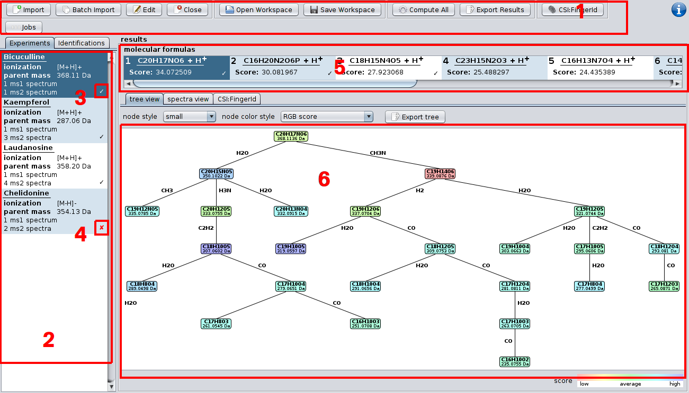
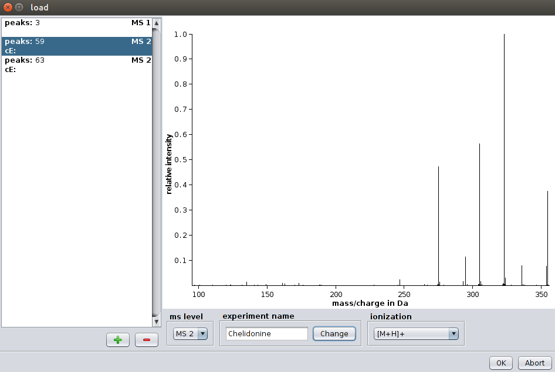
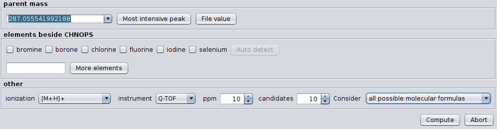
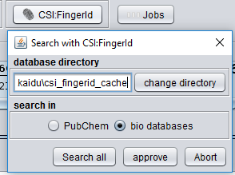
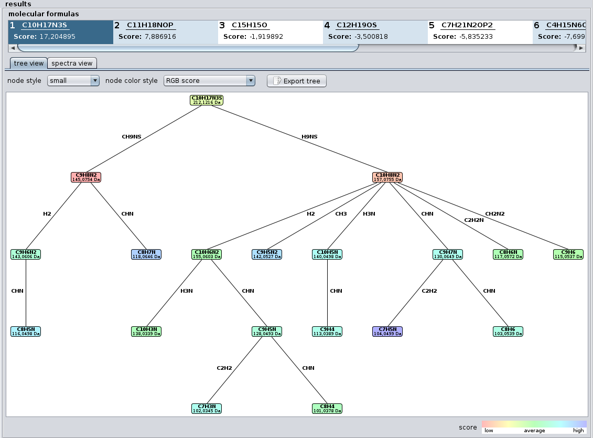
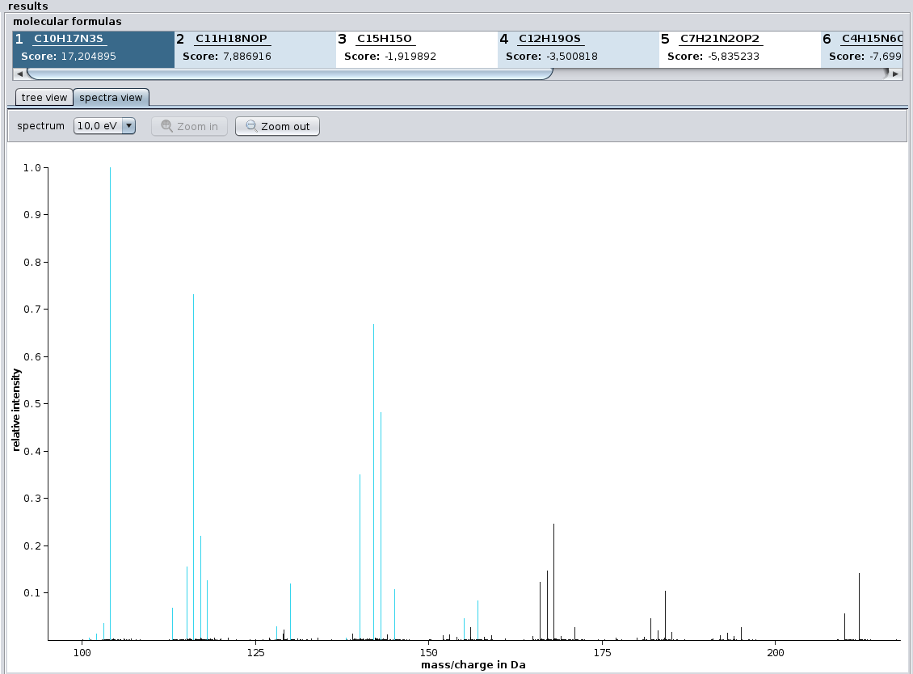
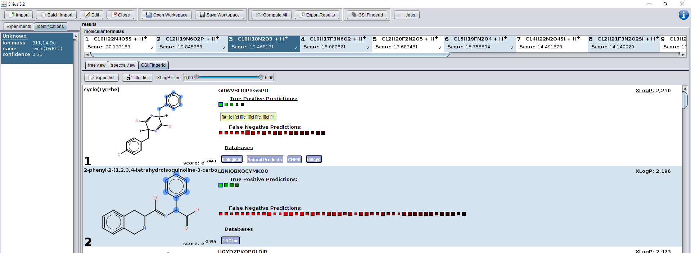

################
User Interface
################

With Sirius 3.1 our software ships with an user interface. Please be aware that the user interface have to be downloaded separately from the commandline tool. Take sure that you downloaded a file named SiriusGUI.exe.

Overview
---------

On top of the screen you find the toolbar(1). On the left side is the experiment list (2) displaying all imported experiments. An experiment describes the set of MS and MS/MS spectra corresponding to a single measured compound. If an experiment is successfully computed you will see a tick mark on the right (3); if something goes wrong during computation you will see a cross symbol (4). The output of a computation is an ordered list of suggested molecular formula candidates. After selecting an experiment in the experiment list the candidate list (5) should display all molecular formula candidates together with their score. When selecting a candidate, the tree viewer (6) displays the computed fragmentation tree. Nodes in the tree are colored according to their score.

Data Import
------------

Sirius offers two modes for data import: **Single Import** and **Batch Import**. The Single Import is triggered when clicking on the *Import* button in the toolbar. It allows you to import **one** experiment. We will use the term experiment as a description of MS and MS/MS spectra belonging to a single compound.
The Single Import mode is recommended if your data consists of several csv (comma separated values) files (like the data from the CASMI challenges). First press on *Import* to start the import dialog.

For each spectrum you have to select the MS level (either MS 1 or MS 2). If you have MSn spectra you can just import them as MS 2 spectra. You can select a name for the experiment as well as an ionization mode. The collision energy is an optional attribute as it does not affect the computation.

You can import *.ms* and *.mgf* files using the *Batch Import*. In this mode Sirius will read all attributes (MS level, ionization, parentmass) directly from the file. You can, however, change these attributes afterwards by selecting the imported experiment and clicking on the **Edit** button.

See section *Supported Input Formats* for a description of the file formats *.ms* and *.mgf*.

Drag and Drop
...............

Sirius supports Drag and Drop: Just move your input files into the application window. This is usually the easiest way to import data into Sirius. Supported file formats for Drag and Drop are *.csv*, *.ms*, *.sirius* and *.mgf*.

Identifying Molecular Formulas with SIRIUS
------------

As for importing data Sirius offers two computation modes: **Single Computation** and **Batch Computation**. The Single Computation allows you to setup different parameters for each experiment. You can trigger it by right-clicking on an experiment and choosing **Compute** in the context menu. The Batch Computation will run in background and compute all experiments in the workspace.

parent mass
..............
The exact m/z of the parent peak. If MS 1 data is present, the m/z of the monoisotopic peak is presented as default. Otherwise, an autocompletion offers a list of high intensive peaks from the MS 2 spectra.

elements besides CHNOPS
........................
Sirius will use the elements carbon (C), hydrogen (H), nitrogen (N), oxygen (O), phosphorus (P) and sulfur (S) by default. Additional elements can be selected in the checkboxes. Adding elements that do not occur in the correct molecular formula of the compound will usually not lead to wrong results but to an increased running time of the algorithm.

other
.........
The ionization mode determines the polarity of the measurement (positive or negative) as well as the adduct (e.g. protonation or sodium adduct). If you choose **Unknown Positive** or **Unknown Negative** Sirius will not care about the adduct, but report the molecular formula of the **ion** in the candidate list. Otherwise, Sirius will subtract the adducts formula from the ions formula and report neutral molecular formulas in the candidate list as well as in the fragmentation trees.

Choose either *Q-TOF*, *Orbitrap* or *FT-ICR* in the instrument field. The chosen instrument affects only very few parameters of the method (mainly the allowed mass deviation). If your instrument is not one of these three then just select the Q-TOF instrument.

You can change the maximal allowed mass deviation in the **ppm** field. Sirius will only consider molecular formulas which mass deviations are either below the chosen ppm or smaller than :math:`\frac{100 \cdot ppm_{max}}{10^6}`

Finally, you can select the number of molecular formula candidates that should be given in the output as well as where they come from.

If you select **All possible molecular formulas** then SIRIUS will enumerate over all molecular formulas that match the ion mass, filtering out only molecular formulas with negative ring double bond equivalent. If you choose **PubChem formulas** then SIRIUS will select all molecular formulas from PubChem. When choosing **formulas from biological databases** SIRIUS will select formulas that are contained in any database of either biological compounds or compounds that could be expected in biological experiments (e.g. KEGG, Biocyc, HMDB but also MaConDa). 

Please consider the following:
 * we never search in any of these databases but instead in our own in-house database. Although we regularly update our database it might happen that some new compound in e.g. CHEBI is not already contained in our own copy of CHEBI.
 * when choosing a database SIRIUS will ignore your element restrictions and instead allow all elements. However, if you provide MS1 spectra SIRIUS can usually determine the elemental composition from them anyways.
 * while we recommend searching in PubChem and filtering the results afterwards, searching in bio databases significantly speeds up the computation, as SIRIUS has to consider much less molecular formulas and have to download much smaller candidate structure lists.

Identifying Molecular Structure with CSI:FingerId
------------

After computing the fragmentation trees you can search these in a structure database. Again we provide a **single mode** and a **batch mode**. The single mode is available by clicking on the molecular formula of interest, then switching to the **CSI:FingerId** tab and pressing on the **Search online with CSI:FingerId** button.
The batch mode can be triggered by pressing on the **CSI:FingerId** in the toolbar.

When starting the CSI:FingerId search you are again asked to choose between PubChem or biological databases. This is mainly a performance issue because you can filter your result lists afterwards by any database you want to. Our biological database is several magnitudes smaller than PubChem and downloading and searching structure lists from biological databases is significantly faster. However, when searching in biological databases you might never see if there are structures with possibly much better score from PubChem. Therefore, we recommend to search in PubChem and filter the result list if you expect the result to be contained in biological databases.

Visualization of the Results
-----------------------------

The candidate list displays the best candidate molecular formulas ordered by score. Molecular formulas are always written in neutral form, except for compounds with unknown ionization mode. For every molecular formula the corresponding fragmentation tree is visualized in the „tree view“ tab. Alternatively, the „spectra view“ tab visualizes which peak is assigned to a fragment.

Tree View
...........

The tree view displays the estimated Fragmentation Tree. Each node in this tree assigns a molecular formula to a peak in the (merged) MS 2 spectrum. Each edge is a hypothetical fragmentation reaction. The user has the choice between different node styles and color schemes. The shown tree can be exported as JPEG, GIF, and PNG. Alternatively, the Dot file format contains only a description of the tree. It can be used to render the tree externally. The command-line tool Graphviz can transform dot files into image formats (PDF, SVG, PNG etc). The JSON format yields a machine-readable representation of the tree.

Spectrum View
..............

In the spectrum view all peaks that are annotated by the Fragmentation Tree are colored in blue. Peaks that are annotated as noise are colored black. Hovering with the mouse over a peak shows its annotation.

CSI:FingerId View
..............

This tab shows you the candidate structures for the selected molecular formula ordered by the CSI:FingerId search score. If you want to filter the candidate list by a certain database (e.g. only compounds from KEGG and Biocyc) you can press the filter button. A menu will open displaying all available databases. Only candidates will be displayed that are enabled in this filter menu. Note that PubChem is enabled by default and, therefore, always the complete list is shown. If you want to see only compounds from KEGG and Biocyc you have to disable PubChem and enable KEGG and Biocyc.

Another way of filtering is the XLogP slider. If you have information about retention times and expected logP values of your measured compound you can use this slider to filter the candidate list by certain XLogP values. The slider allows you to define min and max values. XLogP is calculated using the CDK development kit [1]. 

The green and red squares are some visualization of the CSI:FingerId predictions and scoring. All green squares represent molecular structures that are found in the candidate structure and are predicted by CSI:FingerId to be present in the measured compound. As lighter the square as more likely is the predicted probability for the presence of this substructure. As larger the square as more reliable is the predictor. The red squares, however, represent structures that are predicted to be absent but are, nevertheless, found in the candidate structure. Again, as lighter the square as higher the predicted probability that this structure should be absent. Therefore, a lot of large light green squares and as few as possible large light red squares are a good indication for a correct prediction.

When hovering with the mouse over these squares the corresponding description of the molecular structure (usually a SMART expression) is displayed. When clicking on one of these squares, the corresponding atoms in the molecule that belong to this substructure are highlighted. If the substructure matches several times in the molecule, it is once highlighted in dark blue while all other matches are highlighted in a translucent blue.

Even if the correct structure is not found by CSI:FingerId - especially if the correct structure is not contained in any database - you can get information about the structure by looking at the predicted structures: When clicking on the large light green squares you see which molecular substructures are expected in the measured compound.  

You can open a context menu by right click on the compound. It offers you to open the compound in PubChem or copy the InChI or InChI key in your clipboard.

If the compound is contained in any biological database, a blue label with the name of this database is displayed below the compound. You can click on most of these labels to open the database entry in your browser window.

You can export a single candidate list by clicking on the **export list** button.

*[1] The Chemistry Development Kit (CDK): An Open-Source Java Library for Chemo- and Bioinformatics. Steinbeck et al, J. Chem. Inf. Comput. Sci., 2003*

Workspace
------------

All imported experiments together with their results (the candidate molecular formulas and corresponding fragmentation trees) form the **workspace**. You can save the workspace into a file by clicking on **Save Workspace** in the toolbar. Analogously, you can load a workspace using **Load Workspace**. The workspace is saved in the **.sirius** format, which is simply a Zip Archive containing the input spectra and fragmentation trees. You can share the *.sirius* files with other people. But be aware that the input spectra are contained in these files!

The Sirius Commandline Tool is able to output *.sirius* files by using the option **-O sirius**. You can import these files with the Sirius User Interface to get a visualization of the results.

Currently, CSI:FingerId predictions are not stored in the *.sirius* file. This will hopefully change in future releases.

Export Results
..............

Next to the *.sirius* format you can also export your results as a simple **csv** file by clicking on the **Export Results** button. Such a *csv* file can then be imported into *Excel*, *Matlab* or *R*. 

The csv file contains the following fields:
 * name of the experiment
 * parent mass
 * ionization
 * for each molecular formula candidate there are two columns: one with the molecular formula and one with the corresponding score

If the number of molecular formula candidates differ between experiments, the number of fields per row might differ, too. However, most software programs do not have a problem with such *malformed* csv files.

Confidence View
..............

When identifying large amounts of spectra with CSI:FingerId you will, unfortunately, get a lot of wrong predictions among the correct ones. With SIRIUS 3.2 we offer a confidence score that reflects the likelihood that some identification is correct. You can list all identifications by opening the **identification** tab.

.. figure:: images/confidence.png

This list contains the top hits in all structure candidate lists ordered by their confidence. Entries at the top are more likely to be correct while entries at the bottom are more likely to be wrong. 

Example Workflow
-----------------

Working in Single Mode
......................

 #. Move the three files *txt/chelidonine_ms.txt*, *txt/chelidonine_msms1.txt* and *chelidonine_msms2.txt* from the demo data via Drag and Drop into the application window
 #. The following dialog offers you to select the columns for mass and intensity values. Just press *Ok* as the default values are already correct.
 #. You see the load dialog with three spectra. The first spectra is wrongly annotated as *MS 2* spectrum but should be an *MS 1* spectrum instead. Just select *MS 1* in the drop down list labeled with *ms level*.
 #. All other options are fine. However, you might want to choose a more memorizable name in the *experiment name* field.
 #. Press the *Ok* button. The newly imported experiment should now appear in your experiment list on the left side.
 #. Choose the experiment, right-click on it and press *Compute*.
 #. In the compute dialog all options should be fine. Just check that the correct parent mass is chosen. You might want to add Chlorine or Fluorine to the set of considered elements. Furthermore, you can change the instrument type to *Orbitrap*
 #. Just look into the candidate list: The first molecular formula has a quite large score. Furthermore, the second molecular formula has a much lower score. This is a good indication that the identification is correct. However, you can take a look at the fragmentation tree: Do the peak annotation look correct? Take a look at the spectrum view: Are all high intensive peaks are explained?
 #. You can now save the result list as csv file (by pressing the *Export Results* button). Maybe you want save your workspace, too. Just press the *Save Workspace* button.

 Working in Batch Mode
 ......................

 #. Move the files *Bicuculline.ms* and *Kaempferol.ms* from the demo data via Drag and Drop into the application window
 #. The two experiments are now displayed in the experiment list
 #. Just check if the ionization and parent mass is correctly annotated. You can change this values by clicking on the experiment and then on *Edit*.
 #. Click on the *Compute All* button.
 #. You can now select the allowed elements, the instrument type as well as the maximal allowed mass deviation. Be aware that this settings will be used for all imported experiments
 #. Choose *Orbitrap* in the instrument field and press *Ok*
 #. A *...* symbol occurs on the lower right corner of each experiment. This means that the experiment will be computed soon. A gear symbol tells you that this experiment is currently computed in background. A check mark appears in all experiments that were successfully computed, a red cross marks experiments which computation fails.
 #. Probably you will not see anything than a check mark, as the computation is very fast. However, if you see a compound with a red cross you might want to compute it again in Single Mode. Check if the parent mass and ionization is correct.
 #. Sometimes a computation might take a long time (e.g. for experiments with a lot of elements or very high masses). You can cancel the computation of a single experiment by selecting *Cancel Computation* in the right-click context menu. You can cancel the computation of all experiments by clicking on *Cancel Computation* in the toolbar.

Identifying a CASMI challenge
..............................

#. Download the files http://casmi-contest.org/2014/Challenge2014/Challenge1/1_MS.txt and http://casmi-contest.org/2014/Challenge2014/Challenge1/1_MSMS.txt
#. Move these files via Drag and Drop into the application window
#. Change the ms level of the first file into *Ms 1*
#. Click on *Ok*
#. Click on *Compute* in the right-click context menu of the imported experiment
#. Choose *Q-TOF* as instrument and press the *Ok* button
#. *C23H46NO7P* should be suggested as number one hit in the candidate list
